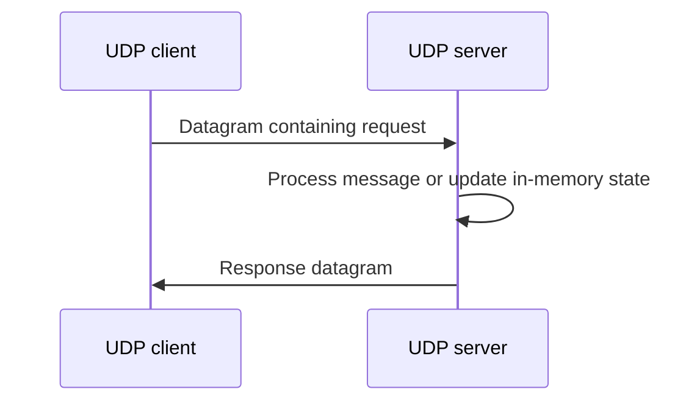
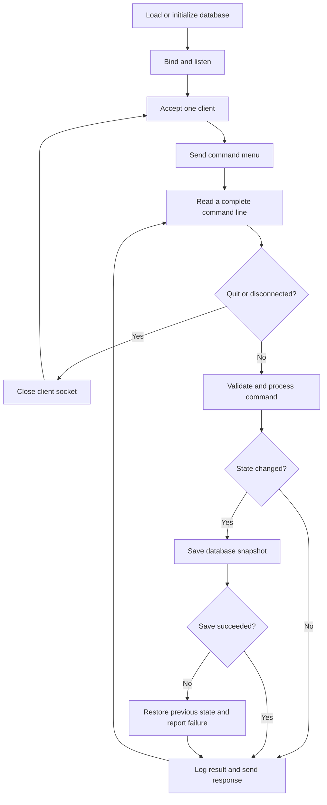

# EX6 · Network Programming in C

**Seven socket-programming exercises that connect transport fundamentals to stateful application design.**

This Computer Networks Laboratory exercise implements three UDP client/server applications and four iterative TCP servers using C and POSIX sockets. The progression moves from exchanging datagrams to managing bookings, appointments, and library records with persistent state, request validation, and transaction rollback.

The code keeps networking and application logic visible: there are no application frameworks, external database services, or hidden server runtimes. All programs use **Allman brace style**.

## At a glance

| Application | Transport | Port | Main concepts | State lifetime |
|---|---|---:|---|---|
| [Chat](Chat/) | UDP | 6001 | Datagram exchange, alternating conversation, termination | Current process |
| [DNS lookup](DNS/) | UDP | 6001 | Local cache, resolver fallback, IPv4 address conversion | Cache in server memory |
| [Address allocation](DHCP/) | UDP | 5000 | Custom message structures, block allocation, capacity tracking | Allocation state in server memory |
| [Railway reservations](Self-Questions/railway_server.c) | TCP | 7001 | Route search, ticket booking, cancellation, fare calculation | Binary snapshot on disk |
| [Hospital appointments](Self-Questions/hospital_server.c) | TCP | 7002 | Patient registration, dated slots, conflict detection, history | Binary snapshot on disk |
| [Movie tickets](Self-Questions/movie_server.c) | TCP | 7003 | Show inventory, seat accounting, booking status | Binary snapshot on disk |
| [College library](Self-Questions/library_server.c) | TCP | 7004 | Catalog search, issue/return lifecycle, borrower history | Binary snapshot on disk |

> Chat and DNS both use UDP port **6001**. Run them separately, or change `PORT` in both files of one pair and rebuild. The UDP clients target localhost; their servers bind to all IPv4 interfaces. The four TCP servers bind to localhost only.

## Repository layout

```text
EX6/
├── Chat/
│   ├── client.c
│   └── server.c
├── DHCP/
│   ├── client.c
│   └── server.c
├── DNS/
│   ├── client.c
│   └── server.c
├── Self-Questions/
│   ├── railway_server.c
│   ├── hospital_server.c
│   ├── movie_server.c
│   └── library_server.c
├── README.md
└── TCP_SERVERS_README.md
```

Each source file builds into its own executable. The TCP programs are intentionally standalone so each question can be compiled and demonstrated independently.

## Build and run

### Requirements

- A POSIX environment, such as macOS or Linux, with a C compiler (`cc`, Clang, or GCC).
- Two terminals for client/server demonstrations; three to demonstrate iterative TCP scheduling.
- Netcat (`nc`) for the TCP command interface.
- A configured system resolver for DNS lookups; public domains may require network access.

Run the following commands **from the `EX6` directory**. Executables go into a temporary directory to keep compiled files out of the source tree.

```sh
export EX6_BUILD_DIR="$(mktemp -d /tmp/ex6-build.XXXXXX)"

for app in Chat DNS DHCP; do
    cc -Wall -Wextra -Werror "$app/server.c" -o "$EX6_BUILD_DIR/${app}_server"
    cc -Wall -Wextra -Werror "$app/client.c" -o "$EX6_BUILD_DIR/${app}_client"
done

for app in railway hospital movie library; do
    cc -std=c11 -Wall -Wextra -Werror "Self-Questions/${app}_server.c" \
        -o "$EX6_BUILD_DIR/${app}_server"
done

printf 'Executables: %s\n' "$EX6_BUILD_DIR"
```

Environment variables are local to each terminal. In another terminal, set `EX6_BUILD_DIR` to the directory printed above before using the commands below.

### UDP applications

Start the server first, then the matching client in a second terminal:

| Exercise | Server terminal | Client terminal |
|---|---|---|
| Chat | `"$EX6_BUILD_DIR/Chat_server"` | `"$EX6_BUILD_DIR/Chat_client"` |
| DNS | `"$EX6_BUILD_DIR/DNS_server"` | `"$EX6_BUILD_DIR/DNS_client"` |
| Address allocation | `"$EX6_BUILD_DIR/DHCP_server"` | `"$EX6_BUILD_DIR/DHCP_client"` |

**Chat:** the client sends first, the server operator replies, and the conversation alternates. Enter `exit` on either side to end the conversation. The implementation checks the first four characters, so any message beginning with `exit` also ends it.

**DNS:** enter `localhost` twice to demonstrate resolution followed by a cache hit. Other domain names use the system resolver when absent from the local table. Enter exactly `exit` to stop the client and server.

**Address allocation:** try `8` total addresses and `2` blocks, then allocate `2` addresses from block `1`. Requesting another `3` from that block demonstrates insufficient-capacity handling. Select block `0` to exit the client; the server remains running.

Stop a remaining server with Ctrl+C before switching exercises.

### TCP applications

Start any server from the build directory:

```sh
"$EX6_BUILD_DIR/railway_server"
```

Connect from another terminal:

```sh
nc 127.0.0.1 7001
```

For the other systems, use `hospital_server` with port `7002`, `movie_server` with `7003`, or `library_server` with `7004`.

Each connection receives a command menu. Type `help` to display it again and `quit` to disconnect gracefully. These servers use a text protocol, so Netcat serves as the client without an additional C client program.

## Architecture and design

### UDP: explicit datagram exchange

The UDP pairs use `socket(AF_INET, SOCK_DGRAM, 0)`, `sendto()`, and `recvfrom()`. The server binds a port and replies to the sender address supplied by `recvfrom()`.



UDP preserves datagram boundaries, but these programs do not add retries, delivery acknowledgements, or receive timeouts. They demonstrate the transport API and application flow rather than a reliable protocol built over UDP.

### TCP: one complete client session at a time

The TCP servers use an outer `accept()` loop and an inner command-processing loop. There is no `fork()`, thread pool, or event loop. A client can perform multiple operations on one connection; the next client is served only after that session ends.



A second client's TCP handshake may complete while it waits in the operating system's connection queue. That does **not** mean the application is serving it: it receives no menu until the current client disconnects.

This design makes transaction ordering easy to reason about, but an idle connected client blocks all clients waiting behind it. That is an intentional consequence of session-level iterative processing.

### TCP framing and request validation

TCP supplies a byte stream, so one `send()` is not assumed to correspond to one `recv()`.

- `read_line()` collects bytes through a newline, handling commands split across packets or multiple commands arriving together.
- Requests use `command|field|field` syntax. Command words are lowercase; names may contain spaces but not `|`.
- Leading and trailing spaces in fields are trimmed. Empty fields, incorrect argument counts, control characters, oversized commands, and invalid numeric values produce errors.
- The input buffer accommodates up to 511 command bytes before the newline. An oversized line is drained so the next command remains synchronized.
- `send_text()` handles partial writes and interrupted system calls. `SIGPIPE` is ignored so a disconnected peer does not terminate the server.

### Persistence with rollback

Every TCP program owns an in-memory database and a corresponding snapshot file. Before handling a command, the server copies its current state. If the command changes records, it writes the new snapshot to a temporary file, calls `fflush()` and `fsync()`, closes the file, and renames it over the previous database.

A confirmation is sent only after that save succeeds. If saving fails, the server restores the previous in-memory state and returns an explicit rollback message. Successful cancellations and returns restore availability, while historical records are retained.

This provides a useful file-based transaction boundary for a single server process. It is not a database engine: there is no multi-process coordination, schema migration, or directory `fsync()` for a complete power-loss durability guarantee.

### Activity logging

The TCP servers append connection events, requests, and operation results to separate log files with local timestamps and client IP addresses. Logging is best effort: a log-write failure is reported locally and does not roll back an otherwise successful database save.

| Server | Database | Log |
|---|---|---|
| Railway | `railway.dat` | `railway.log` |
| Hospital | `hospital.dat` | `hospital.log` |
| Movie | `movie.dat` | `movie.log` |
| Library | `library.dat` | `library.log` |

Files are created in the server's **working directory**, not automatically beside its source or executable. Restart from the same directory to reload the same records. Run only one instance against each database, and keep generated binary files unedited.

## Application walkthroughs

The examples below assume a fresh database. Use the IDs returned by your own session when records already exist.

### 1. Railway reservation system

Three sample trains provide routes, departure times, seat capacities, and fares. Route search matches complete origin and destination names without case sensitivity.

| Command | Operation |
|---|---|
| `list` | List trains, routes, departure times, available seats, and fares |
| `search|origin|destination` | Find trains serving a route |
| `availability|train_id` | Inspect one train's inventory |
| `book|train_id|seats|passenger_name` | Reserve seats and calculate the total fare |
| `status|booking_id` | View passenger, train, seats, price, and booking status |
| `cancel|booking_id` | Cancel an active booking and restore its seats |

```text
search|Chennai|Bengaluru
availability|1
book|1|2|Alex Kumar
status|1
cancel|1
availability|1
quit
```

For the first sample train, booking two seats changes availability from 120 to 118 and produces a total fare of Rs 700. Cancelling restores availability to 120. A second cancellation is rejected, preventing duplicate restoration.

### 2. Hospital appointment system

Three doctors have specialties and four daily consultation slots each. Appointments are indexed by doctor, calendar date, and slot; an active booking makes that combination unavailable.

| Command | Operation |
|---|---|
| `doctors` | List doctors, specialties, and consultation windows |
| `register|patient_name|age` | Register a patient and receive a patient ID |
| `availability|doctor_id|YYYY-MM-DD` | Inspect all four slots for a doctor on a date |
| `book|patient_id|doctor_id|YYYY-MM-DD|slot_id` | Book an available consultation slot |
| `cancel|appointment_id` | Cancel an appointment and release its slot |
| `history|patient_id` | View patient details and active/cancelled appointments |

```text
register|Alex Kumar|22
availability|1|2030-10-10
book|1|1|2030-10-10|1
history|1
cancel|1
availability|1|2030-10-10
quit
```

Date validation accounts for month lengths and leap years. The exercise permits historical dates and accepts patient ages from 1 to 120. It prevents double-booking the same doctor/date/slot; it does not enforce patient conflicts across different doctors.

### 3. Movie ticket system

Three sample shows store movie names, screens, show timings, seat capacities, and ticket prices. A service ID represents one show.

| Command | Operation |
|---|---|
| `list` | List movies and show information |
| `availability|show_id` | Check remaining seats and ticket price |
| `book|show_id|seats|customer_name` | Reserve tickets and calculate the total |
| `status|booking_id` | Inspect booking details and status |
| `cancel|booking_id` | Cancel an active booking and restore seats |

```text
list
book|1|3|Alex Kumar
status|1
availability|1
cancel|1
quit
```

Seats are tracked as counts, not assigned seat numbers. Requests exceeding the available count are rejected without changing inventory.

### 4. College library system

The catalog stores book ID, title, author, category, and availability. Each entry represents one physical copy. Search performs case-insensitive substring matching against titles and authors.

| Command | Operation |
|---|---|
| `list` | Display the catalog |
| `search|title_or_author_text` | Find matching books |
| `availability|book_id` | Inspect a book's status |
| `issue|book_id|borrower_name` | Issue an available book and generate an issue ID |
| `return|issue_id` | Return a book using its issue record |
| `issued|borrower_name` | View current and returned issue records |

```text
search|networks
search|Tanenbaum
issue|1|Alex Kumar
issued|Alex Kumar
return|1
availability|1
quit
```

The return operation uses an **issue ID**, not a book ID. Keeping these separate preserves borrowing history when the same book is issued again.

## Understanding the DNS and DHCP exercises

### DNS lookup service

The client sends a domain string over UDP. The server first searches a table of up to 100 cached records. On a miss, it calls `getaddrinfo()` for an IPv4 address, converts that address with `inet_ntop()`, caches it if space remains, and replies to the client.

This is a **custom UDP lookup service backed by the operating system resolver**. It does not implement DNS packet encoding, authoritative service, recursive resolution, or cache TTL expiry. The local cache uses exact, case-sensitive string matching and disappears when the server stops.

### DHCP-style address allocation

The client and server exchange a custom C `Message` structure containing a request type, allocation parameters, status, and a text payload. The request types are setup, allocate, and exit.

Setup rounds the requested address count up to a power of two, divides it into blocks, and generates a `192.168.x` prefix. Allocation scans a selected block and marks available addresses as assigned. A new setup replaces the previous in-memory allocation state.

This is an **address-allocation simulation**, not a DHCP implementation. It does not use DHCP wire packets, discovery broadcasts, leases, MAC-based assignments, or operating-system interface configuration. Its ranges are simplified last-octet ranges rather than general CIDR subnet calculations.

## Verification and demonstration

All ten source files have been compiled locally with warnings treated as errors. The four TCP programs also compile explicitly as C11. Local socket checks covered:

| Area | Verified behavior |
|---|---|
| UDP chat | Message exchange and termination from either side |
| DNS | Resolution of `localhost`, repeated lookup, and exit |
| Address allocation | Setup, allocation, insufficient capacity, invalid block, and exit |
| TCP operations | Booking/issuing, lookup/history, cancellation/return, and restored availability |
| Validation | Invalid commands, empty fields, oversized input, invalid numbers, and unavailable resources |
| Stream handling | Multiple commands in one TCP write |
| Iterative processing | Second connection receives no service until the first session ends |
| Persistence | Records remain available after server restart |
| Save failure | Failed snapshot writes roll back the in-memory transaction |
| Logging | Activity files are generated during sessions |

These were local development checks; a reusable automated test suite and CI workflow are not currently included in this folder. Warning-free compilation is not a claim that every input or failure mode is covered.

### Demonstrate iterative behavior in three terminals

1. Start the railway server.
2. Connect client A with `nc 127.0.0.1 7001` and leave its session open.
3. Connect client B using the same command. B waits without receiving the application menu.
4. Enter `quit` in A. B now receives the menu and can issue commands.

This demonstrates the distinction between a queued TCP connection and an application actively processing a client.

## Scope, tradeoffs, and next steps

The implementations prioritize visible control flow and laboratory demonstration. Their boundaries are part of the design discussion:

| Current boundary | Implication / possible extension |
|---|---|
| One active TCP session, without an idle timeout | A slow or idle client blocks others; add session timeouts before exploring concurrent servers |
| Fixed-size tables | Each TCP application retains at most 200 historical bookings/appointments/issues; hospital registration permits 100 patients |
| Retained cancellation/return records | IDs remain stable and are not reused, but historical entries still consume capacity |
| Raw binary database snapshots | Layout depends on the compiler/platform; introduce versioned serialization or SQLite for portability and stronger validation |
| Single demonstration schedule for trains and movies | Add travel/show dates and per-date inventory for a richer reservation model |
| No login, ownership checks, or TLS | These local lab services do not provide authenticated access; names and operations also appear in logs |
| Native C structures sent by the DHCP simulation | Peers must agree on structure layout and byte order; a portable wire format would remove that dependency |
| Basic UDP input handling | Add timeouts, checked input conversion, bounded formatting, and malformed-packet validation |

The UDP exercises also retain known buffer-safety issues: a full-size chat datagram can overrun the terminator position, an overly long domain can overflow the DNS cache's domain field, and large allocation responses can overflow the DHCP text buffer. DHCP arithmetic and allocation inputs need additional bounds checks. Keep demonstrations small and controlled; these issues remain separate from the earlier behavior-preserving refactor.

For GitHub, track source and documentation, and exclude generated executables, `.DS_Store`, runtime `.dat` / `.dat.tmp` snapshots, and `.log` files. The build instructions above already keep executables outside this folder.

## Engineering discussion points

This exercise provides concrete examples for explaining:

- **Transport semantics:** why UDP exposes datagrams while TCP requires application-level framing.
- **Server scheduling:** why a completed handshake does not imply immediate application service in an iterative server.
- **State invariants:** why repeated cancellation must not restore seats twice, and why returning an already-returned book must fail.
- **Commit ordering:** why a success response follows persistence, and how rollback keeps memory consistent after a save failure.
- **Protocol boundaries:** why calling the system resolver is different from implementing DNS, and why allocating addresses is only one part of DHCP.
- **Evolution toward larger systems:** where concurrency, portable storage, authorization, timeouts, and automated tests would fit.
