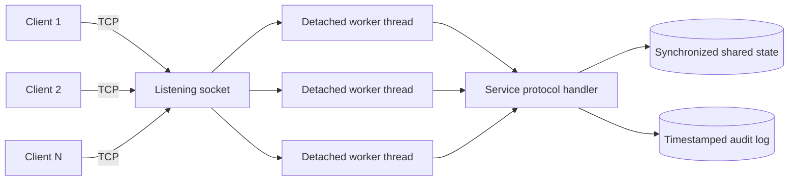

# EX7 — Concurrent TCP Systems in C

> A socket-programming laboratory that grows from focused client/server exercises into four concurrent, stateful TCP services with synchronization, persistence, logging, defensive protocol parsing, and integration tests.


## Why this project is more than a socket demo

Opening a socket is the easy part. The interesting engineering begins when clients overlap, disconnect halfway through a request, send malformed input, compete for the same resource, or receive a partial TCP write.

This repository addresses those cases explicitly:

- thread-per-connection servers with a bounded 64-client limit;
- complete-send loops and framed, bounded line parsing over TCP streams;
- mutex-protected shared state with deliberately small critical sections;
- independent per-client sessions and cleanup after abrupt disconnects;
- durable, replayable hotel transactions committed with `fsync`;
- race-free chat broadcasts with per-client output serialization;
- file downloads with exact byte counts, partial-write handling, and path validation;
- timestamped, mutex-serialized activity logs;
- integration tests for real concurrent races, persistence, malformed traffic, and binary transfers;
- warning-clean C11 builds, also exercised with AddressSanitizer and UndefinedBehaviorSanitizer.

## Systems included

| System | Concurrency model | Shared-state guarantee | Notable behavior |
| --- | --- | --- | --- |
| ARP lookup | One request per connection | Mutex-protected simulated ARP table | Hashing with linear probing; generated MAC mappings; system ARP display |
| Interactive chat | Process per client | Independent connection state | Bidirectional terminal conversation and clean quit handling |
| Basic file transfer | Process per client | Independent file streams | Filename header followed by raw file bytes |
| Online examination | Thread per client | Account/session and question locks | Authentication, isolated answer sheets, evaluation, duplicate-login prevention |
| Hotel reservation | Thread per client | Single transactional booking mutex | Exactly one winner per room, secure reservation tokens, durable journal replay |
| File sharing | Thread per client | Independent descriptors and directory streams | Concurrent listing/download, binary-safe framing, symlink/path rejection |
| Chat notification | Thread per client | Client registry plus per-client output locks | Broadcast messages, presence events, live user list, safe disconnect cleanup |

The first three programs demonstrate the core socket lifecycle. The four systems under `Self-Questions/` apply those fundamentals to realistic concurrency and failure scenarios.

## Architecture



The advanced servers share a small networking layer in `Self-Questions/common/`:

- `tcp_serve()` validates the port, creates the listener, accepts clients, enforces the connection limit, and launches detached workers.
- `recv_line()` converts the TCP byte stream into printable ASCII request lines and rejects oversized, truncated, or malformed frames.
- `send_all()` handles short writes and interrupted system calls until the entire response is transmitted.
- `log_event()` serializes timestamped activity records so concurrent threads cannot interleave log lines.
- `terminal.c` is a polling interactive client used by the examination, hotel, and notification-chat systems.

The shared layer ignores `SIGPIPE`, applies receive/send timeouts, and guarantees socket and client-count cleanup when a worker exits.

## Repository layout

```text
EX7/
├── ARP/
│   ├── client.c
│   └── server.c
├── Chat/
│   ├── client.c
│   └── server.c
├── File/
│   ├── client.c
│   └── server.c
├── Self-Questions/
│   ├── Examination/server.c
│   ├── Hotel/server.c
│   ├── FileSharing/{server.c, client.c}
│   ├── ChatNotification/server.c
│   ├── common/{net.c, net.h, terminal.c}
│   ├── tests/check_systems.py
│   └── Makefile
└── README.md
```

## Prerequisites

- a POSIX environment such as macOS or Linux;
- a C11 compiler (`cc`, Clang, or GCC);
- POSIX sockets and pthreads;
- `make` and Python 3 for the advanced-system test suite.

## Quick start

Build the advanced systems from the repository root:

```bash
make -C Self-Questions
```

The default output directory is `/tmp/ex7-systems-bin`, keeping compiled executables out of the source tree:

```text
examination_server    examination_client
hotel_server          hotel_client
files_server          files_client
chat_server           chat_client
```

Choose another external build directory when needed:

```bash
make -C Self-Questions BUILD_DIR=/tmp/my-ex7-build
```

Run the integration suite:

```bash
make -C Self-Questions check
```

Run the same suite with memory and undefined-behavior instrumentation:

```bash
SANITIZE=1 make -C Self-Questions check
```

For runtime files, use a directory outside the repository:

```bash
mkdir -p /tmp/ex7-runtime/shared
cd /tmp/ex7-runtime
```

## 1. Online Examination Management System

The examination service keeps each student's answers and final score inside that connection's session. A mutex protects the account registry, preventing the same username from being active twice. Question reads and evaluation use a separate lock; question data is copied before network output so a slow client never holds the database lock.

Start the server and client in separate terminals:

```bash
# Terminal 1 — from /tmp/ex7-runtime
/tmp/ex7-systems-bin/examination_server 9001

# Terminal 2
/tmp/ex7-systems-bin/examination_client 127.0.0.1 9001
```

Demo accounts:

| Username | Password |
| --- | --- |
| `student1` | `exam1` |
| `student2` | `exam2` |
| `student3` | `exam3` |
| `student4` | `exam4` |

Example session:

```text
LOGIN student1 exam1
QUESTIONS
ANSWER 1 B
ANSWER 2 C
ANSWER 3 A
FINISH
SCORE
QUIT
```

`FINISH` evaluates the answers exactly once. Repeated `FINISH` or `SCORE` requests return the stored result, and answers cannot change after submission. Credentials are redacted from `examination.log`.

## 2. Hotel Reservation System

The hotel has ten rooms. A single transaction lock covers the availability check, reservation mutation, and disk commit, making the check-and-book operation atomic. When 16 clients race for one room, exactly one receives the booking.

```bash
# Terminal 1
/tmp/ex7-systems-bin/hotel_server 9002 reservations.journal

# Terminal 2
/tmp/ex7-systems-bin/hotel_client 127.0.0.1 9002
```

Example session:

```text
AVAILABLE
BOOK 1 Alice
DETAILS <token-returned-by-BOOK>
CANCEL <token-returned-by-BOOK>
QUIT
```

A successful booking returns a random 128-bit bearer token:

```text
OK BOOKED 1 TOKEN 8c3d...32-hex-characters
```

The append-only journal records `BOOK` and `CANCEL` events and is replayed on startup. Each mutation is fully written and synchronized to disk before memory changes or success is reported. The process holds an exclusive lock on the journal, so two server instances cannot accidentally manage the same data. Corrupt or incomplete records stop startup instead of silently discarding reservations.

Guest names accept 1–31 ASCII letters, digits, underscores, or hyphens. The private `hotel.log` provides an audit trail of requests and results.

## 3. Concurrent File Sharing Server

The file-sharing protocol combines line-framed commands with length-framed binary data. Each transfer uses its own file descriptor and buffer, allowing large and empty files to move concurrently without mixing bytes between clients.

```bash
# Put files in the shared directory, then start the server
/tmp/ex7-systems-bin/files_server 9003 shared

# List available regular files
/tmp/ex7-systems-bin/files_client 127.0.0.1 9003 LIST

# Download without overwriting an existing destination
/tmp/ex7-systems-bin/files_client 127.0.0.1 9003 GET report.pdf downloaded-report.pdf
```

Wire format for a download:

```text
C: GET report.pdf\n
S: DATA 42817\n
S: <exactly 42,817 raw bytes>
```

Only regular files directly inside the configured shared directory are exposed. The server rejects paths, `.`/`..`, symbolic links, directories, special files, and invalid names. The client removes a partial output file if a transfer is interrupted and refuses to overwrite an existing destination.

## 4. Chat Notification System

Clients join with a unique display name and receive messages and presence notifications asynchronously. The active-client registry is protected by a mutex, while each client has an output mutex that prevents simultaneous broadcasts from interleaving response bytes.

```bash
# Terminal 1
/tmp/ex7-systems-bin/chat_server 9004

# Terminals 2, 3, ...
/tmp/ex7-systems-bin/chat_client 127.0.0.1 9004
```

Example session:

```text
JOIN Alice
MSG Hello everyone
WHO
QUIT
```

Recipients see `MESSAGE Alice Hello everyone`; all joined clients receive `NOTICE Alice joined` and `NOTICE Alice left` presence events. Broadcasts snapshot referenced client entries and release the registry mutex before network I/O. A slot is not reused until outstanding send references are released, avoiding descriptor-reuse races during disconnects.

Concurrent senders may produce different valid message orders for different recipients; the service guarantees complete, non-interleaved messages rather than a global total order.

## Foundational exercises

The smaller exercises can be compiled directly into `/tmp`:

```bash
cc -std=c11 -D_POSIX_C_SOURCE=200809L -Wall -Wextra -Wpedantic ARP/server.c -o /tmp/arp_server -pthread
cc -std=c11 -Wall -Wextra -Wpedantic ARP/client.c -o /tmp/arp_client

cc -std=c11 -Wall -Wextra -Wpedantic Chat/server.c -o /tmp/basic_chat_server
cc -std=c11 -Wall -Wextra -Wpedantic Chat/client.c -o /tmp/basic_chat_client

cc -std=c11 -Wall -Wextra -Wpedantic File/server.c -o /tmp/basic_file_server
cc -std=c11 -Wall -Wextra -Wpedantic File/client.c -o /tmp/basic_file_client
```

Typical invocation patterns:

```bash
/tmp/arp_server 8001              # client: /tmp/arp_client 127.0.0.1 8001
/tmp/basic_chat_server 8002       # client: /tmp/basic_chat_client 127.0.0.1 8002
/tmp/basic_file_server 8003       # client: /tmp/basic_file_client 127.0.0.1 8003
```

The ARP service maintains a simulated hash table and consults the host ARP cache. The basic chat uses a process per client for interactive request/reply conversation. The file-transfer pair sends a filename header followed by the original file bytes.

## Protocol contract and operational limits

Advanced-system commands are case-sensitive printable ASCII lines terminated by LF or CRLF. A line may contain at most 1,023 characters excluding its terminator. The servers reject oversized lines, embedded NUL bytes, malformed CRLF, invalid numbers, extra arguments, and truncated requests.

Responses begin with `OK`, `ERR`, or a documented data/event keyword. Multi-line responses terminate with `END`. Raw binary appears only after a file server `DATA <byte-count>` header.

| Limit | Value |
| --- | ---: |
| Simultaneous connected clients per server | 64 |
| Request-line buffer | 1,024 bytes |
| Receive inactivity timeout | 300 seconds |
| Send timeout | 5 seconds |
| Hotel rooms | 10 |
| Examination questions | 3 |

The servers bind to all IPv4 interfaces. Local clients use `127.0.0.1`; remote clients use the server's reachable IPv4 address. `QUIT` closes a session normally, while abrupt disconnects still release sockets, connection counts, login state, and chat membership.

## Verification

The Python suite launches actual server processes on ephemeral ports and drives real TCP clients. It currently contains nine integration scenarios covering:

- four simultaneous examination sessions, duplicate-login rejection, scoring, and disconnect cleanup;
- sixteen clients racing to reserve the same room, followed by restart, replay, lookup, and cancellation;
- exclusive journal ownership and corrupt-journal refusal;
- twelve parallel binary and empty-file downloads;
- path traversal, absolute path, symlink, FIFO, and missing-file rejection;
- interrupted-transfer cleanup and continued service after an aborted download;
- eight simultaneous chat participants broadcasting and disconnecting;
- oversized, non-ASCII, embedded-NUL, malformed-CRLF, truncated, and byte-fragmented requests;
- end-to-end behavior of all four client executables.

Test builds add `-Werror`, so warnings fail the suite. Setting `SANITIZE=1` adds AddressSanitizer and UndefinedBehaviorSanitizer instrumentation.

## Design decisions and tradeoffs

- **Thread per connection:** simple session ownership and readable control flow, bounded at 64 clients. An event-driven design would scale further but add complexity that is unnecessary for this laboratory scope.
- **Text commands plus explicit binary lengths:** easy to inspect with a terminal while still supporting arbitrary file contents without delimiter ambiguity.
- **No network I/O under core data locks:** question data is copied first, hotel responses are sent after committing and unlocking, and chat broadcasts use referenced snapshots.
- **Append-only reservation journal:** easy to audit and recover. Long-running deployments would add compaction or move to a transactional database.
- **Bearer booking tokens:** prevent room-number-only cancellation. Production deployment would add authenticated users, authorization policy, TLS, and protected secret storage.
- **Immutable shared files during transfer:** the implementation opens and validates the selected file safely, but does not snapshot files modified externally during a download.
- **Laboratory authentication:** examination accounts are intentionally fixed in source. A deployed system would use a database, salted password hashes, TLS, rate limiting, and persistent attempt records.

## Logs and generated data

The advanced servers create these files in their working directory:

| File | Purpose |
| --- | --- |
| `examination.log` | Connections, redacted login attempts, requests, and scores |
| `hotel.log` | Booking request/result audit trail |
| `files.log` | File requests and transfer completion/interruption |
| `chat.log` | Connections, chat commands, and disconnects |
| chosen journal path | Durable hotel booking and cancellation events |

Log records use local ISO-style timestamps and are flushed after each event. New log and journal files are created with owner-only permissions.

## What this exercise demonstrates

This project is intentionally small enough to audit, but it tackles the failure modes that separate a classroom socket example from a dependable network service: TCP has no message boundaries, writes may be partial, clients disappear, shared state races, storage fails, identifiers are reused, and untrusted input crosses every connection. The code makes those constraints visible and testable instead of hiding them behind a framework.

---

Built as Computer Networks Laboratory Exercise 7 using C11, POSIX sockets, pthreads, processes, file descriptors, and explicit application-layer protocols.
